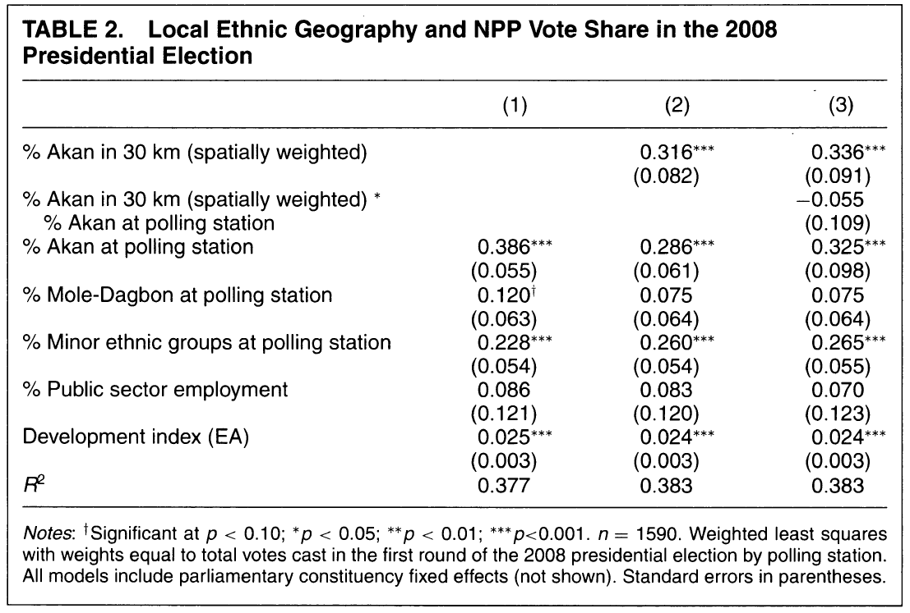

```{r setup, include=FALSE}
knitr::opts_chunk$set(echo = FALSE)
library(multiwayvcov)
library(sandwich)
library(Zelig)
library(MASS)
library(stargazer)
library(gt)
library(tidyverse)
```

```{r data-setup}
# read in data

polling_data <- read.csv("Data/IchinoNathan_APSR_pollingstation_data.csv", header=TRUE)
survey_data <- read.csv("Data/IchinoNathan_APSR_survey_data.csv")

```


## Abstract

In their paper "Crossing the Line: Local Ethnic Geography and Voting in Ghana," Nahomi Ichino and Noah Nathan found that the local ethnic demographics of the area in which Ghanian voters live affected who they chose to support in the 2008 Ghana presidential election. I successfully replicated Ichino and Nathan (2013)'s results. I have also reexamined their models and added additional variables to explore the effect of a voter's trust in members of their own ethnicity and members of other ethnicities. I found that the inclusion of this variable does not significantly alter the model. As a result, trust in one's co-ethnics or in others of a different ethnicity do not impact one's voting decisions as much as the demographics of one's location do.  

## Introduction

Researchers have long sought to explore how a voter's ethnicity affects their voting preferences. This issue becomes more salient in countries where patronage politics is an issue. It is commonly thought that voters will support candidates who share their same ethnicity because they expect that candidate to then favor other co-ethnics. Ichino and Nathan (2013), however, shows that the demographics of the area in which a voter lives also matter. Using voting data from the 2008 Ghana presidential election and survey data from the Afrobarometer, they found that a voter who lives in an area dominated by one ethnicity is more likely to support a candidate whose ethnicity matches that of the area in which they live, not their own ethnicity.

In replicating Ichino and Nathan (2013), I used R. The data and code come from Harvard Dataverse. The code in this paper can be found on GitHub^[The repo for this project is [here](https://github.com/angelafu7/CrossingTheLineReplication)].

I have chosen to reexamine the regressions Ichino and Nathan (2013) built to predict the likelihood that an individual support the New Patrotic Party or the National Democratic Congress. I have added variables that measure whether an individual trusts co-ethnics and whether they trust non-co-ethnics, as those two factors will likely influence their voting decisions. After running the new regressions, however, I found that the primary results from Ichino and Nathan (2013) did not change significantly.  

## Literature Review

The effect ethnicity has on elections in sub-Saharan Africa has long been studied by researchers. This is because many politicians engage in patronage, and voters have come to expect that the provision of public goods will be determined in part by ethnicity. Essentially, voters expect that politicians will provide more goods to people who share their same ethnicity.

The view that ethnicity and voting are linked has come to be widely accepted. Research has shown, for example, that countries that are ethnically heterogenous have resulted in the under-provision of non-excludable public goods but a high prevalence of patronage goods [@R-Kimenyi].

Though this view has been widely adopted, increasing research has shown that the link may not be so simple. For example, research using results from the Afrobarometer, a series of surveys distributed across the continent, shows that voters take other factors into consideration. For example, one study found that voters in addition to considering ethnic ties, will also base their votes on economic outcomes [@R-Bratton].

The case of Ghana in particular is interesting because the results of its 2008 presidential election do not confrom with the theory that ethnicity and voter preferences are so simply linked. The two parties, the National Democratic Congress and the New Patriotic Party, saw support from voters across ethnic lines. One theory for this phenomenon is that the perceptions of the individual parties and candidates had more of an effect on how voters cast their ballot [@R-Hoffman]. 

However, Ichino and Nathan have found instead that while ethnicity does play a role, it does not do so in the way most researchers would expect. Though some voters certainly do vote along ethnic lines, others vote across those lines when they live in an area that is heavily populated by members of another ethnic group. The reason behind this is that they expect the candidate they choose to better provide public goods to areas in which they saw the most support. In Ghana, the president has a high amount of influence over how public goods are distributed. These goods are often nonexcludable, so everyone living in the area benefits, regardless of their ethnicity. Thus, it is in voters' best interest to voter across ethnic lines if they are surrounded by members of a different ethnicity.   

## Paper Review

Ichino and Nathan (2013) first examines data at the polling station level. Using 2008 presidential election results from the Brong Ahafo Region, a rural, ethnically diverse region of Ghana, they created models predicting support for the NPP based on characteristics of the area surrounding a polling station. They found that the proportion of Akans in the area and at the polling station were a key factor in prediciting NPP vote share. Areas with a high percentage of Akans had polling stations report significantly greater support for the NPP, even after controlling for the ethnic demographics at the individual polling stations. This makes sense because in Ghana, the NPP is closely associated with the Akan ethnic group. Similarly, the NDC is closely associated with the Ewe ethnic group. Other ethnic groups are split fairly evenly in their support for either party.  

Though the first part of Ichino and Nathan (2013) confirms the trend one expects to see if local demographics influence voter choices, it does not confirm individual voter behavior. As a result, the second part of Ichino and Nathan (2013) examines survey data from the 2005 and 2008 rounds of the Afrobarometer to create models at the individual level. The Afrobarometer includes information about enumeration areas, which allowed Ichino and Nathan (2013) to determine the local demographics of the respondent's area. 

Ichino and Nathan created four main models. The logistic models predict the probability that a respondent supports either the NPP or the NDC. Their models include variables representing the proportions of various ethnic groups in the respondent's area, as well as the respondent's gender, their opinion of the current economic condition compared to a year ago, their poverty level, and the survey round in which they participated. The models showed statistically significant relationships between the population shares of the Akan and Ewe and support for the NPP and NDC. 

## Replication

I was mostly able to replicate the major results of Ichino and Nathan (2013). There are some discrepencies between the clustered standard errors in my models, compared to theirs, which likely stem from their decision to use Stata to create the models. I used multiwaycov to create clusters instead and received very similar standard errors. Ichino and Nathan (2013) also included some calculations for the clusters done in R, but I had to modify the code as theirs used R packages that are no longer supported.

## Extension

Though Ichino and Nathan (2013)'s primary models do not include the variables measuring trust, the paper does test several models with the addition of trustother. However, these models are limited in that they are only examined in the context of non-Akans. Furthermore, only the variable trustother, which measures the degree to which respondents reported trusting members of other ethnic groups, is added.

I added both trustown, which examines the degree to which respondents reported trusting members of their own ethnic group, and trustother to the primary models. The additions of these variables allows for exploration as to whether voters are primarily driven by their desire for club goods or their personal perceptions of the candidate. Furthermore, a voter who does not trust a candidate may decide they they cannot count on the candidate to reward their supporters. Because I have added trustown and trustother, I eliminated r4, which indicates whether the respondent came from round 3 or round 4 of the Afrobarometer. This is because only round 3 included questions about trust. 

I also split up the data so that each model is applied to a different ethnic group, and I removed ethnic group variables accordingly. The first table shows the models for members of the Akan ethnic group. 

```{r ext-akan, results = "asis"}
# Create dataframe for the extension. Replicates the new variable added in the original model and filters out results from urban areas and round 4
data_ext <- survey_data %>%
  mutate(akan30_central = akan_30km_l_p*central) %>%
  filter(urb == 0, 
         r4 == 0)

# Separate dataframe for Akans
data_ext_akan <- data_ext %>%
  filter(eth_akan == 1)

# The following are models with trustown and trustother added
m1 <- glm(vote_npp_pres ~ akan_30km_l_p + akan30_central + male + economy_oneyear + poverty + dev_factor2 + central + trustown + trustother, family = "binomial", data = data_ext_akan)

# R does not have an easy way to cluster standard errors the way Stata does. I used this workaround with cluster.vcov
m1.cov <-cluster.vcov(m1, data_ext_akan$fid0725)
m1.se <- sqrt(diag(m1.cov))

m2 <- glm(vote_ndc_pres ~ akan_30km_l_p + akan30_central + male + economy_oneyear + poverty + dev_factor2 + central + trustown + trustother, family = "binomial", data = data_ext_akan)

m2.cov <-cluster.vcov(m2, data_ext_akan$fid0725)
m2.se <- sqrt(diag(m2.cov))

m3 <- glm(vote_npp_pres ~ ewe_30km_l_p + male + economy_oneyear + poverty + dev_factor2 + central + trustown + trustother, family = "binomial", data = data_ext_akan)

m3.cov <-cluster.vcov(m3, data_ext_akan$fid0725)
m3.se <- sqrt(diag(m3.cov))

m4 <- glm(vote_ndc_pres ~ ewe_30km_l_p + male + economy_oneyear + poverty + dev_factor2 + central + trustown + trustother, family = "binomial", data = data_ext_akan)

m4.cov <-cluster.vcov(m4, data_ext_akan$fid0725)
m4.se <- sqrt(diag(m4.cov))

# Stargazer table with settings that largely replicated original table except this one contains new models from the extension
stargazer(m1, m2, m3, m4,
          type = "latex", 
          style = "apsr", 
          title = "TABLE 1. Local Ethnic Geography and Individual-Level Party Support: Rural", notes = "\\parbox[t]{17cm}{Notes: *p < 0.05; **p < 0.01; ***p < 0.001. Logistic regression coefficients with standard errors clustered at enumeration area level in parentheses. Outcome in columns 1 and 3 is support for NPP; outcome in columns 2 and 4 is support for NDC. Data is from Rounds 4 of the Ghana Afrobarometer, excluding respondents from local areas estimated to have more than 1000 people per sq. km}",
          notes.append = FALSE,
          header = FALSE,
          omit.stat = c("aic", "ll"),
          column.labels = c("NPP", "NDC", "NPP", "NDC"),
          dep.var.labels.include = FALSE,
          font.size = "small",
          se = list(m1.se, m2.se, m3.se, m4.se),
          float = FALSE,
          covariate.labels = c("\\% Akan in 30 km (spatially weighted)", "\\% Akan in 30 km (spatially weighted) * Central Region", "\\% Ewe in 30 km (spatially weighted)", "Male", "Economic approval", "Poverty (individual)", "Development index (EA)", "Central Region", "Trust Own", "Trust Other", "Intercept"))

```


The second table contains models applied to respondents who are not Akan.


```{r ext-other, results = "asis"}
# Creates dataframe of non-Akans
data_ext_other <- data_ext %>%
  filter(eth_akan == 0)

# Developp new models based on the non-Akan dataframe with trustown and trustother added
m1a <- glm(vote_npp_pres ~ akan_30km_l_p + akan30_central + eth_ewe + eth_dagomba + male + economy_oneyear + poverty + dev_factor2 + central + trustown + trustother, family = "binomial", data = data_ext_other)

# Clusters the standard errors
m1a.cov <-cluster.vcov(m1a, data_ext_other$fid0725)
m1a.se <- sqrt(diag(m1a.cov))

m2a <- glm(vote_ndc_pres ~ akan_30km_l_p + akan30_central + eth_ewe + eth_dagomba + male + economy_oneyear + poverty + dev_factor2 + central + trustown + trustother, family = "binomial", data = data_ext_other)

m2a.cov <-cluster.vcov(m2a, data_ext_other$fid0725)
m2a.se <- sqrt(diag(m2a.cov))

m3a <- glm(vote_npp_pres ~ ewe_30km_l_p + eth_ewe + eth_dagomba + male + economy_oneyear + poverty + dev_factor2 + central + trustown + trustother, family = "binomial", data = data_ext_other)

m3a.cov <-cluster.vcov(m3a, data_ext_other$fid0725)
m3a.se <- sqrt(diag(m3a.cov))

m4a <- glm(vote_ndc_pres ~ ewe_30km_l_p + eth_ewe + eth_dagomba + male + economy_oneyear + poverty + dev_factor2 + central + trustown + trustother, family = "binomial", data = data_ext_other)

m4a.cov <-cluster.vcov(m4a, data_ext_other$fid0725)
m4a.se <- sqrt(diag(m4a.cov))

# Another stargazer table using similar settings to the original to display the new models

stargazer(m1a, m2a, m3a, m4a,
          type = "latex", 
          style = "apsr", 
          title = "TABLE 1. Local Ethnic Geography and Individual-Level Party Support: Rural", notes = "\\parbox[t]{17cm}{Notes: *p < 0.05; **p < 0.01; ***p < 0.001. Logistic regression coefficients with standard errors clustered at enumeration area level in parentheses. Outcome in columns 1 and 3 is support for NPP; outcome in columns 2 and 4 is support for NDC. Data is from Rounds 4 of the Ghana Afrobarometer, excluding respondents from local areas estimated to have more than 1000 people per sq. km}",
          notes.append = FALSE,
          header = FALSE,
          omit.stat = c("aic", "ll"),
          column.labels = c("NPP", "NDC", "NPP", "NDC"),
          dep.var.labels.include = FALSE,
          font.size = "small",
          se = list(m1a.se, m2a.se, m3a.se, m4a.se),
          float = FALSE,
          covariate.labels = c("\\% Akan in 30 km (spatially weighted)", "\\% Akan in 30 km (spatially weighted) * Central Region", "\\% Ewe in 30 km (spatially weighted)", "Ewe", "Dagomba (Mole)", "Male", "Economic approval", "Poverty (individual)", "Development index (EA)", "Central Region", "Trust Own", "Trust Other", "Intercept"))
```


Though there are some differences between these new models and the old ones, the primary conclusions Ichino and Nathan found do not change. The spatially weighted proportions of Akan and Ewe in the respondent's area still remain significant predictors of support for either party. Similarly, the respondent's view on how the economy has changed is still statistically significant. 

Trust in co-ethnics and non-co-ethnics does not appear to be a major predictor for non-Akans. However, for Akans, trust in others does appear to matter. Interestingly, the relationship is negative, meaning Akans who reported trusting non-co-ethnics are less likely to vote for the party associated with a different ethnic group.  

Because the addition of trustown and trustother did not significantly alter the original findings, most of Ichino and Nathan (2013)'s conclusions can be considered more robust than they initially claimed. Their model still produces the same results even after the addition of two other variables, indicating that local demographics play a major role in a voter's decision calculus. This is especially true for non-Akans. However, within the Akan group, trust appears to play some role, but it is still not as significant as local demographics.  

## Conclusion

Ichino and Nathan (2013) confirm that ethnic voting may not be as straightforward as some believe. Through their analysis of the 2008 presidential election in Ghana, they find that local ethnic geography can affect individuals' voting patterns. For example, an Akan who lives in an area heavily populated by Ewes may decide to vote for the Ewe-associated NDC party. Voters choose to cross ethnic lines in their voting because they expect politicians to reward areas in which they received heavy support, i.e. areas that are heavily populated but co-ethnics. 

I replicated Ichino and Nathan's findings using R. All of the code used in this paper can be found on Github, an example of a successful replication of one of their key findings is attached to the Appendix. The original code and data used for Ichino and Nathan's paper can also be found on Github and in the Harvard Dataverse.

After replicating Ichino and Nathan's findings, I added variables measuring trust in co-ethnics and non-co-ethnics to their models. I then ran the new models on two subsets of the data, Akans and non-Akans. In doing so, I found that the primary findings of Ichino and Nathan's original paper—that local geography is closely associated with voter preference—remained largely unchanged. This is a testament to the robustness of their original conclusions.

Though the primary findings did not change much, I did find that trust in non-co-ethnics did play some role in voter choice among Akans, especially in determining their support for the NDC party. Surprisingly, the relationship was negative and could be the subject of additional research in the future.

## Appendix

```{r table1, include = FALSE, eval = FALSE}
# Table 1 replication

# choose pertinent data for the table

data1 <- polling_data %>%
  select(area_sqkm, sex_total, akan_p_poly, gadangbe_p_poly, ewe_p_poly, guan_p_poly, gurma_p_poly, moledagbon_p_poly, grusi_p_poly, mande_p_poly, other_eth_p_poly, ethfrac_poly, english_percent, public_semipublic_p, dev_factor2, akan_30km_l_p, h_30rad_e)

# create new table

table1 <- matrix(NA, nrow=ncol(data1), ncol=4)

# this calculates summary statistics for each variable

for(i in 1:ncol(data1)){
table1[i,1] <- mean(data1[,i])
table1[i,2] <- sd(data1[,i])
table1[i,3] <-min(data1[,i])
table1[i,4] <-max(data1[,i])
}

# this labels the summary statistics

colnames(table1)<-c("Mean", "SD", "Min", "Max")

# this cuts off the numbers so there are no trailing digits

table1 <- round(table1, digits=2)

# this vector contains row lables

Variable <- c("Area (sq. km.)", "Total population", "% Akan at polling station", "% Ga-Dangbe at polling station", "% Ewe at polling station", "% Guan at polling station", "% Gurma at polling station", "% Mole-Dagbon at polling station", "% Grusi at polling station", "Mande at polling station", "% Other ethnic groups at polling station", "Ethnic fractionalization", "% Speak English", "% Public/semipublic employment", "Development index (EA)", "Akan in 30 km (spatially weighted)", "Segregation (H) in 30 km")

# add the row labels to the final table

table1 <- cbind(Variable, table1)

# use gt to make the table well-formatted and to add more details

gttable1 <- gt(table1) %>%
  tab_header(
    title = "Table 1",
    subtitle = "Summary Statistics for Enumeration Areas around Brong Ahafo Polling Stations" 
    ) %>%
  tab_source_note(
        source_note = md("*Note: n* = 1633. Data sources described in the text")
      )

# print table

gttable1
```

Results from Ichino and Nathan (2013) were successfully replicated. As an example, here is Table 2 from page 351.



```{r table2, results = "asis"}
# Table 2 replication

# Dataframe needed for table 2

data2 <- polling_data %>%
  select(npp2008ps_pres_p, ndc2008ps_pres_p, akan_p_poly, ewe_p_poly, moledagbon_p_poly, public_semipublic_p, dev_factor2, akan_30km_l_p, akan_20km_l_p, akan_40km_l_p, ewe_30km_l_p, ewe_20km_l_p, ewe_40km_l_p, h_30rad_e, c230_id_h, otherethn_p_poly, totalvotes2008ps_pres, ethfrac_30km_l, akan_p) %>%
  na.omit()

# Models originally displayed in table 2

t2_m1 <- lm(npp2008ps_pres_p ~ akan_p_poly + moledagbon_p_poly + otherethn_p_poly + public_semipublic_p + dev_factor2 + factor(c230_id_h), data=data2, weights=totalvotes2008ps_pres)

t2_m2 <- lm(npp2008ps_pres_p ~ akan_p_poly + moledagbon_p_poly + otherethn_p_poly + public_semipublic_p + dev_factor2 + akan_30km_l_p + factor(c230_id_h), data=data2, weights= totalvotes2008ps_pres)

t2_m3 <- lm(npp2008ps_pres_p ~ akan_p_poly  + moledagbon_p_poly + otherethn_p_poly + public_semipublic_p + dev_factor2 + akan_30km_l_p + I(akan_30km_l_p*akan_p_poly) + factor(c230_id_h), data=data2, weights= totalvotes2008ps_pres)

# Stargazer table displaying original models

stargazer(t2_m1, t2_m2, t2_m3, 
          type = "latex", 
          style = "apsr",
          order = c(6,7,1,2,3,4,5),
          keep = c("\\bakan_30km_l_p\\b", "\\bakan_p_poly\\b", "\\bmoledagbon_p_poly\\b", "\\botherethn_p_poly\\b", "\\bpublic_semipublic_p\\b", "\\bdev_factor2\\b"),
          omit.stat = c("n", "adj.rsq", "ser", "f"),
          covariate.labels = c("\\% Akan in 30 km (spatially weighted)", "\\% Akan in 30 km (spatially weighted) * \\% Akan at polling station", "\\% Akan at polling station", "\\% Mole-Dagbon at polling station", "\\% Minor ethnic groups at polling station", "\\% Public sector employment", "Development index (EA)"),
          title = "TABLE 2. Local Ethnic Geography and NPP Vote Share in the 2008 Presidential Election",
          dep.var.labels.include = FALSE,
          notes = "\\parbox[t]{17cm}{Notes: Significant at p < 0.10; *p < 0.05; **p < 0.01; ***p < 0.001. n = 1580. Weighted least squares with weights equal to total votes cast in the first round of the 2008 presidential election by polling station. All models include parliamentary constituency fixed effects (not shown). Standard errors in parentheses}",
          notes.append = FALSE,
          header = FALSE,
          float = FALSE)
```

```{r table3, include = FALSE, eval = FALSE}
# Table 3 replication

# choose pertinent data for the table

data3 <- survey_data %>% 
  filter(const230_h != "KUMASI") %>%
  select(eth_akan, eth_ewe, eth_ga, eth_dagomba, vote_npp_pres, vote_ndc_pres, economy_oneyear, unfair, poverty, urb, trustother, gov_sentus, male, central, r4, akan_30km_l_p, ewe_30km_l_p, akan_5km_l_p, ewe_5km_l_p, popdens5x5, dev_factor2)
  
table3 <- matrix(NA, nrow=ncol(data3), ncol=4)

# this calculates summary statistics for each variable

for(i in 1:ncol(data3)){
table3[i,1] <- mean(data3[,i], na.rm = TRUE)
table3[i,2] <- sd(data3[,i], na.rm = TRUE)
table3[i,3] <-min(data3[,i], na.rm = TRUE)
table3[i,4] <-max(data3[,i], na.rm = TRUE)
}

# this labels the summary statistics

colnames(table3)<-c("Mean", "SD", "Min", "Max")

# this cuts off the numbers so there are no trailing digits

table3 <- round(table3, digits=2)

# this vector contains row lables

Variable3 <- c("Akan", "Ewe", "Ga", "Dogomba (Mole-Dagbon", "Vote NPP", "Vote NDC", "Economy approval", "Unfair", "Poverty (individual)", "Urban", "Trust other group", "Enumerator sent by government", "Male", "Central Region", "Round 4", "% Akan in 30 km (spatially weighted)", "% Ewe in 30 km (spatially weighted)", "% Akan in 5 km (spatially weighted)", "% Ewe in 5 km (spatially weighted)", "Population density (5-km x 5-km area)", "Development index (EA)")

# add the row labels to the final table

table3 <- cbind(Variable3, table3)

# use gt to make the table well-formatted and to add more details

gttable3 <- gt(table3) %>%
  tab_header(
    title = "TABLE 3",
    subtitle = "Summary Statistics for Individual-Level Analysis"
    ) %>%
  cols_label(
    Variable3 = "Variable"
  ) %>%
  tab_row_group(
    group = "Afrobarometer",
    rows = 1:15
  ) %>%
  tab_row_group(
    group = "Local Area Characteristics (from Census)",
    rows = 16:21
  ) %>%
  tab_source_note(
        source_note = md("*Notes*: All Afrobarometer variables are binary, except for Economy Approval (1 to 5) and Poverty. Data sources described in the text. *n* = 2287, except for 'Trust other group,' which is Round 3 only (n=1108)")
      )

# print table

gttable3
```

```{r table4, results= "asis", include = FALSE, eval = FALSE}
# Creates dataframe for table 4 models

data4 <- survey_data %>%
  mutate(akan30_central = akan_30km_l_p*central) %>%
  filter(urb == 0)

# Copy of the original model

t4_m1 <- glm(vote_npp_pres ~ akan_30km_l_p + akan30_central + eth_akan + eth_ewe + eth_dagomba + male + economy_oneyear + poverty + dev_factor2 + central + r4, family = "binomial", data = data4)

# R does not calculate clustered standard errors as easily as Stata does, so this chunk is an attempt to replicate those clustered SEs

t4_m1.cov <-cluster.vcov(t4_m1, data4$fid0725)
t4_m1.se <- sqrt(diag(t4_m1.cov))

t4_m2 <- glm(vote_ndc_pres ~ akan_30km_l_p + akan30_central + eth_akan + eth_ewe + eth_dagomba + male + economy_oneyear + poverty + dev_factor2 + central + r4, family = "binomial", data = data4)

t4_m2.cov <-cluster.vcov(t4_m2, data4$fid0725)
t4_m2.se <- sqrt(diag(t4_m2.cov))

t4_m3 <- glm(vote_npp_pres ~ ewe_30km_l_p + eth_akan + eth_ewe + eth_dagomba + male + economy_oneyear + poverty + dev_factor2 + central + r4, family = "binomial", data = data4)

t4_m3.cov <-cluster.vcov(t4_m3, data4$fid0725)
t4_m3.se <- sqrt(diag(t4_m3.cov))

t4_m4 <- glm(vote_ndc_pres ~ ewe_30km_l_p + eth_akan + eth_ewe + eth_dagomba + male + economy_oneyear + poverty + dev_factor2 + central + r4, family = "binomial", data = data4)

t4_m4.cov <-cluster.vcov(t4_m4, data4$fid0725)
t4_m4.se <- sqrt(diag(t4_m4.cov))

# Stargazer table with the original models

stargazer(t4_m1, t4_m2, t4_m3, t4_m4,
          type = "latex", 
          style = "apsr", 
          covariate.labels = c("\\% Akan in 30 km (spatially weighted)", "\\% Akan in 30 km (spatially weighted) * Central Region", "\\% Ewe in 30 km (spatially weighted)", "Akan", "Ewe", "Dagomba (Mole)", "Male", "Economic approval", "Poverty (individual)", "Development index (EA)", "Central Region", "Round 4", "Intercept"),
          title = "TABLE 4. Local Ethnic Geography and Individual-Level Party Support: Rural", notes = "\\parbox[t]{15cm}{Notes: *p < 0.05; **p < 0.01; ***p < 0.001. Logistic regression coefficients with standard errors clustered at EA level in parentheses. Outcome in columns 1 and 3 is support for NPP; outcome in columns 2 and 4 is support for NDC. Data are from Rounds 3 and 4 of the Ghana Afrobarometer, excluding respondents from local areas estimated to have more than 1000 people per sq. km}",
          notes.append = FALSE,
          header = FALSE,
          omit.stat = c("aic", "ll"),
          column.sep.width = "-15pt",
          column.labels = c("NPP", "NDC", "NPP", "NDC"),
          dep.var.labels.include = FALSE,
          se = list(t4_m1.se, t4_m2.se, t4_m3.se, t4_m4.se))
```

```{r table5, results = "asis", include = FALSE, eval = FALSE}
# creates dataframe to be used in table 5

data5 <- survey_data %>%
  filter(urb == 1) %>%
  filter(const230_h != "KUMASI")

# copy of original model

t5a_m1 <- glm(vote_npp_pres ~ akan_30km_l_p + eth_akan + eth_ewe + eth_dagomba + male + economy_oneyear + poverty + dev_factor2 + r4, family = "binomial", data = data5)

# used cluster.vcov to calculate clustered standard errors because R cannot do so in one line of code the way Stata can

t5a_m1.cov <-cluster.vcov(t5a_m1, data5$fid0725)
t5a_m1.se <- sqrt(diag(t5a_m1.cov))
 
t5a_m2 <- glm(vote_ndc_pres ~ akan_30km_l_p + eth_akan + eth_ewe + eth_dagomba + male + economy_oneyear + poverty + dev_factor2 + r4, family = "binomial", data = data5)

t5a_m2.cov <-cluster.vcov(t5a_m2, data5$fid0725)
t5a_m2.se <- sqrt(diag(t5a_m2.cov))

t5a_m3 <- glm(vote_npp_pres ~ ewe_30km_l_p + eth_akan + eth_ewe + eth_dagomba + male + economy_oneyear + poverty + dev_factor2 + r4, family = "binomial", data = data5)

t5a_m3.cov <-cluster.vcov(t5a_m3, data5$fid0725)
t5a_m3.se <- sqrt(diag(t5a_m3.cov))

t5a_m4 <- glm(vote_ndc_pres ~ ewe_30km_l_p + eth_akan + eth_ewe + eth_dagomba + male + economy_oneyear + poverty + dev_factor2 + r4, family = "binomial", data = data5)

t5a_m4.cov <-cluster.vcov(t5a_m4, data5$fid0725)
t5a_m4.se <- sqrt(diag(t5a_m4.cov))

t5b_m1 <- glm(vote_npp_pres ~ akan_5km_l_p + eth_akan + eth_ewe + eth_dagomba + male + economy_oneyear + poverty + dev_factor2 + r4, family = "binomial", data = data5)

t5b_m1.cov <-cluster.vcov(t5b_m1, data5$fid0725)
t5b_m1.se <- sqrt(diag(t5b_m1.cov))

t5b_m2 <- glm(vote_ndc_pres ~ akan_5km_l_p + eth_akan + eth_ewe + eth_dagomba + male + economy_oneyear + poverty + dev_factor2 + r4, family = "binomial", data = data5)

t5b_m2.cov <-cluster.vcov(t5b_m2, data5$fid0725)
t5b_m2.se <- sqrt(diag(t5b_m2.cov))

t5b_m3 <- glm(vote_npp_pres ~ ewe_5km_l_p + eth_akan + eth_ewe + eth_dagomba + male + economy_oneyear + poverty + dev_factor2 + r4, family = "binomial", data = data5)

t5b_m3.cov <-cluster.vcov(t5b_m3, data5$fid0725)
t5b_m3.se <- sqrt(diag(t5b_m3.cov))

t5b_m4 <- glm(vote_ndc_pres ~ ewe_5km_l_p + eth_akan + eth_ewe + eth_dagomba + male + economy_oneyear + poverty + dev_factor2 + r4, family = "binomial", data = data5)

t5b_m4.cov <-cluster.vcov(t5b_m4, data5$fid0725)
t5b_m4.se <- sqrt(diag(t5b_m4.cov))

# I broke table 5 into two stargazer tables as I could not figure out how to combine them

stargazer(t5a_m1, t5a_m2, t5a_m3, t5a_m4, 
          type = "latex", 
          style = "apsr", 
          column.sep.width = "-15pt",
          column.labels = c("NPP", "NDC", "NPP", "NDC"),
          dep.var.labels.include = FALSE, 
          notes.append = FALSE, 
          keep = c("\\bakan_30km_l_p\\b", "\\bewe_30km_l_p\\b"),
          omit.stat = c("n", "aic", "ll"),
          covariate.labels = c("\\% Akan in 30 km (spatially weighted)", "\\% Ewe in 30 km (spatially weighted)"),
          title = "TABLE 5a. Local Ethnic Geography and Individual-Level Party Support: Urban", 
          header = FALSE,
          se = list(t5a_m1.se, t5a_m2.se, t5a_m3.se, t5a_m4.se))

stargazer(t5b_m1, t5b_m2, t5b_m3, t5b_m4, 
          type = "latex", 
          style = "apsr", 
          column.sep.width = "-15pt",
          column.labels = c("NPP", "NDC", "NPP", "NDC"),
          dep.var.labels.include = FALSE, 
          notes.append = FALSE,
          keep = c("\\bakan_5km_l_p\\b", "\\bewe_5km_l_p\\b"),
          omit.stat = c("n", "aic", "ll"),
          covariate.labels = c("\\% Akan in 5 km (spatially weighted)", "\\% Ewe in 5 km (spatially weighted)"),
          title = "TABLE 5b. Local Ethnic Geography and Individual-Level Party Support: Urban", 
          header = FALSE,
          se = list(t5b_m1.se, t5b_m2.se, t5b_m3.se, t5b_m4.se))

```

```{r figure4, include = FALSE, eval = FALSE}
# set.seed to get the same result as paper

set.seed(02138)

# read in data and clean it

dataf4 <- survey_data %>%
  select(eth_akan, eth_ewe, eth_dagomba, central, akan_30km_l_p, ewe_30km_l_p, vote_npp_pres, vote_ndc_pres, male, economy_oneyear, poverty, dev_factor2, r4, fid0725, popdens5x5) %>%
  na.omit() %>%
  filter(popdens5x5 < 1000) %>%
  mutate(int = central*akan_30km_l_p)

# create smaller datasets to analyze model's effects on different subgroups

survey_data_akan <- dataf4 %>%
  filter(eth_akan==1)

survey_data_ewe <- dataf4 %>%
  filter(eth_ewe==1)

survey_data_mole <- dataf4 %>% 
  filter(eth_dagomba==1)

### AKAN 30 & NPP
### for Akans:

# creates model

f4_m1 <- glm(vote_npp_pres ~ akan_30km_l_p + int + dev_factor2 + male  +economy_oneyear + poverty + central + r4, data=survey_data_akan, family=binomial(link="logit"))

# calculates clustered standard errors 
w.dist<- survey_data_akan %>%
  select(vote_npp_pres, akan_30km_l_p, int, dev_factor2, male, economy_oneyear, poverty, central, r4, fid0725) %>%
  na.omit() 
dist.fan <- factor(w.dist[,ncol(w.dist)])
mat <- estfun(f4_m1)
N <- nrow(mat)
u <- apply(mat, 2, function(x) tapply(x, dist.fan, sum)) %>% na.omit()
K <- f4_m1$rank
df <- (length(unique(w.dist[,ncol(w.dist)])) / (length(unique(w.dist[,ncol(w.dist)])) - 1))*((N - 1)/ (N - K))
vcovCL <- df*sandwich(f4_m1, meat = crossprod(u)/N)

a.akan_30km.vals <- seq(quantile(survey_data_akan$akan_30km_l_p, probs=c(.1,.9))[1], quantile(survey_data_akan$akan_30km_l_p, probs=c(.1,.9))[2], 0.001)

# use zelig_setx_to_df to turn setx into a dataframe

x.m1<- setx(f4_m1,r4=1,male=1,economy_oneyear=3,central=0,int=0) %>%
  zelig_setx_to_df() %>%
  as.matrix()

# eliminate first column of betas matrix so that matrix multiplication will work later

betas <- mvrnorm(n = 1000, mu=summary(f4_m1)$coefficients[,1], vcovCL)
betas <- betas[,-1]

# generates list of predictions that can later be graphed

predictions.m1 <- matrix(NA, nrow=1000, ncol=length(a.akan_30km.vals))
for(i in 1:1000){
	for(j in 1:length(a.akan_30km.vals)){
	x.m1[2] <- a.akan_30km.vals[j]
	predictions.m1[i, j] <- 1 / (1 + exp(-x.m1 %*% betas[i,]))
		}
	}
m1.mean <- apply(X = predictions.m1, MARGIN=2, FUN=mean)
m1.lower <- apply(predictions.m1, 2, quantile, 0.025)
m1.upper <- apply(predictions.m1, 2, quantile, 0.975)

### for Ewes:
f4_m2 <- glm(vote_npp_pres ~ akan_30km_l_p + int  + dev_factor2 + male  +economy_oneyear + poverty + central + r4, data=survey_data_ewe, family=binomial(link="logit"))

w.dist<- survey_data_ewe %>%
  select(vote_npp_pres, akan_30km_l_p, int, dev_factor2, male, economy_oneyear, poverty, central, r4, fid0725) %>%
  na.omit() 
dist.fan<-factor(w.dist[,ncol(w.dist)])
mat <- estfun(f4_m2)
N <- nrow(mat)
u <- apply(mat, 2, function(x) tapply(x, dist.fan, sum)) %>%
  na.omit()
K<-f4_m2$rank
df <- (length(unique(w.dist[,ncol(w.dist)])) / (length(unique(w.dist[,ncol(w.dist)])) - 1))*((N - 1)/ (N - K))
vcovCL2 <- df*sandwich(f4_m2, meat=crossprod(u)/N)
final<-coeftest(f4_m2, vcovCL2)

e.akan_30km.vals <- seq(quantile(survey_data_ewe$akan_30km_l_p, probs=c(.1,.9))[1], quantile(survey_data_ewe$akan_30km_l_p, probs=c(.1,.9))[2], 0.001)
x.m2<- setx(f4_m2,r4=1,male=1,economy_oneyear=3,central=0)%>%
  zelig_setx_to_df() %>%
  as.matrix()
betas <- mvrnorm(n = 1000, mu=summary(f4_m2)$coefficients[,1], vcovCL2)
betas <- betas[,-1]
predictions.m2 <- matrix(NA, nrow=1000, ncol=length(e.akan_30km.vals))
for(i in 1:1000){
	for(j in 1:length(e.akan_30km.vals)){
	x.m2[2] <- e.akan_30km.vals[j]
	predictions.m2[i, j] <- 1 / (1 + exp(-x.m2 %*% betas[i,]))
		}
	}
m2.mean <- apply(X = predictions.m2, MARGIN=2, FUN=mean)
m2.lower <- apply(predictions.m2, 2, quantile, 0.025)
m2.upper <- apply(predictions.m2, 2, quantile, 0.975)

### For Mole/Dagbons:
f4_m3 <- glm(vote_npp_pres ~ akan_30km_l_p  + dev_factor2 + male  +economy_oneyear + poverty + r4, data=survey_data_mole, family=binomial(link="logit"))
w.dist<- survey_data_mole %>%
  select(vote_npp_pres, akan_30km_l_p, dev_factor2, male, economy_oneyear, poverty, central, r4, fid0725) %>%
  na.omit() 
dist.fan<-factor(w.dist[,8])
mat <- estfun(f4_m3)
N <- nrow(mat)
u <- apply(mat, 2, function(x) tapply(x, dist.fan, sum)) %>%
  na.omit()
K<-f4_m3$rank
df <- (length(unique(w.dist[,8])) / (length(unique(w.dist[,8])) - 1))*((N - 1)/ (N - K))
vcovCL3 <- df*sandwich(f4_m3, meat=crossprod(u)/N)
final<-coeftest(f4_m3, vcovCL3)

m.akan_30km.vals <- seq(quantile(survey_data_mole$akan_30km_l_p, probs=c(.1,.9))[1], quantile(survey_data_mole$akan_30km_l_p, probs=c(.1,.9))[2], 0.001)
x.m3<- setx(f4_m3,r4=1,male=1,economy_oneyear=3)%>%
  zelig_setx_to_df() %>%
  as.matrix()

betas <- mvrnorm(n = 1000, mu=summary(f4_m3)$coefficients[,1], vcovCL3)
betas <- betas[,-1]
predictions.m3 <- matrix(NA, nrow=1000, ncol=length(m.akan_30km.vals))
for(i in 1:1000){
	for(j in 1:length(m.akan_30km.vals)){
	x.m3[2] <- m.akan_30km.vals[j]
	predictions.m3[i, j] <- 1 / (1 + exp(-x.m3 %*% betas[i,]))
		}
	}
m3.mean <- apply(X = predictions.m3, MARGIN=2, FUN=mean)
m3.lower <- apply(predictions.m3, 2, quantile, 0.025)
m3.upper <- apply(predictions.m3, 2, quantile, 0.975)

#### EVERYONE TOGETHER

f4_m4<-glm(vote_npp_pres~ akan_30km_l_p +int + eth_akan + eth_ewe + eth_dagomba + male + economy_oneyear + poverty + dev_factor2 + central + r4, family=binomial(link="logit"), data=dataf4)

### clustered standard errors
w.dist<- dataf4 %>%
  select(vote_npp_pres, akan_30km_l_p, int, dev_factor2, male, economy_oneyear, poverty, central, r4, fid0725) %>%
  na.omit()
dist.fan<-factor(w.dist[,ncol(w.dist)])
mat <- estfun(f4_m4)
mat <- na.omit(mat)
N <- nrow(mat)
u <- apply(mat, 2, function(x) tapply(x, dist.fan, sum)) %>%
  na.omit()
K<-f4_m4$rank
df <- (length(unique(w.dist[,ncol(w.dist)])) / (length(unique(w.dist[,ncol(w.dist)])) - 1))*((N - 1)/ (N - K))
vcovCL4 <- df*sandwich(f4_m4, meat=crossprod(u)/N)
final<-coeftest(f4_m4, vcovCL4)

all.akan_30km.vals <- seq(quantile(dataf4$akan_30km_l_p, probs=c(.1,.9))[1], quantile(dataf4$akan_30km_l_p, probs=c(.1,.9))[2], 0.001)
set.seed(02138)
x.m4<- setx(f4_m4,r4=1,male=1,economy_oneyear=3, central=0)%>%
  zelig_setx_to_df() %>%
  as.matrix()
betas <- mvrnorm(n = 1000, mu=summary(f4_m4)$coefficients[,1], vcovCL4)
betas <- betas[,-1]
predictions.m4 <- matrix(NA, nrow=1000, ncol=length(all.akan_30km.vals))
for(i in 1:1000){
	for(j in 1:length(all.akan_30km.vals)){
	x.m4[2] <- all.akan_30km.vals[j]
	predictions.m4[i, j] <- 1 / (1 + exp(-x.m4 %*% betas[i,]))
		}
	}
m4.mean <- apply(X = predictions.m4, MARGIN=2, FUN=mean)
m4.lower <- apply(predictions.m4, 2, quantile, 0.025)
m4.upper <- apply(predictions.m4, 2, quantile, 0.975)

#################
## AKAN 30 & NDC
#################
### for Akans:
f4_m1b <- glm(vote_ndc_pres ~ akan_30km_l_p + int+ dev_factor2 + male  +economy_oneyear + poverty + central + r4  , data=survey_data_akan, family=binomial(link="logit"))
w.dist<- survey_data_akan %>%
  select(vote_ndc_pres, akan_30km_l_p , int, dev_factor2, male, economy_oneyear, poverty, central, r4, fid0725) %>%
  na.omit()
dist.fan<-factor(w.dist[,ncol(w.dist)])
mat <- estfun(f4_m1b)
N <- nrow(mat)
u <- apply(mat, 2, function(x) tapply(x, dist.fan, sum)) %>%
  na.omit(u)
K<-f4_m1b$rank
df <- (length(unique(w.dist[,ncol(w.dist)])) / (length(unique(w.dist[,ncol(w.dist)])) - 1))*((N - 1)/ (N - K))
vcovCL <- df*sandwich(f4_m1b, meat=crossprod(u)/N)

a.akan_30km.vals <- seq(quantile(survey_data_akan$akan_30km_l_p, probs=c(.1,.9))[1], quantile(survey_data_akan$akan_30km_l_p, probs=c(.1,.9))[2], 0.001)
x.m1<- setx(f4_m1b,r4=1,male=1,economy_oneyear=3,central=0,int=0) %>%
  zelig_setx_to_df() %>%
  as.matrix()
betas <- mvrnorm(n = 1000, mu=summary(f4_m1b)$coefficients[,1], vcovCL)
betas <- betas[,-1]

predictions.m1 <- matrix(NA, nrow=1000, ncol=length(a.akan_30km.vals))
for(i in 1:1000){
	for(j in 1:length(a.akan_30km.vals)){
	x.m1[2] <- a.akan_30km.vals[j]
	predictions.m1[i, j] <- 1 / (1 + exp(-x.m1 %*% betas[i,]))
		}
	}
m1b.mean <- apply(X = predictions.m1, MARGIN=2, FUN=mean)
m1b.lower <- apply(predictions.m1, 2, quantile, 0.025)
m1b.upper <- apply(predictions.m1, 2, quantile, 0.975)


### for Ewes:
f4_m2b <- glm(vote_ndc_pres ~ akan_30km_l_p +int + dev_factor2 + male  +economy_oneyear + poverty + central + r4, data=survey_data_ewe, family=binomial(link="logit"))
w.dist<- survey_data_ewe %>%
  select(vote_ndc_pres, akan_30km_l_p, int, dev_factor2, male, economy_oneyear, poverty, central, r4, fid0725) %>%
  na.omit()
dist.fan<-factor(w.dist[,ncol(w.dist)])
mat <- estfun(f4_m2b)
N <- nrow(mat)
u <- apply(mat, 2, function(x) tapply(x, dist.fan, sum)) %>%
  na.omit()
K<-f4_m2b$rank
df <- (length(unique(w.dist[,ncol(w.dist)])) / (length(unique(w.dist[,ncol(w.dist)])) - 1))*((N - 1)/ (N - K))
vcovCL2 <- df*sandwich(f4_m2b, meat=crossprod(u)/N)
final<-coeftest(f4_m2b, vcovCL2)

e.akan_30km.vals <- seq(quantile(survey_data_ewe$akan_30km_l_p, probs=c(.1,.9))[1], quantile(survey_data_ewe$akan_30km_l_p, probs=c(.1,.9))[2], 0.001)
x.m2<- setx(f4_m2b,r4=1,male=1,economy_oneyear=3,central=0,int=0)%>%
  zelig_setx_to_df() %>%
  as.matrix()
betas <- mvrnorm(n = 1000, mu=summary(f4_m2b)$coefficients[,1], vcovCL2)
betas <- betas[,-1]

predictions.m2 <- matrix(NA, nrow=1000, ncol=length(e.akan_30km.vals))
for(i in 1:1000){
	for(j in 1:length(e.akan_30km.vals)){
	x.m2[2] <- e.akan_30km.vals[j]
	predictions.m2[i, j] <- 1 / (1 + exp(-x.m2 %*% betas[i,]))
		}
	}
m2b.mean <- apply(X = predictions.m2, MARGIN=2, FUN=mean)
m2b.lower <- apply(predictions.m2, 2, quantile, 0.025)
m2b.upper <- apply(predictions.m2, 2, quantile, 0.975)


### For Mole/Dagbons:
f4_m3b <- glm(vote_ndc_pres ~ akan_30km_l_p  + dev_factor2 + male  +economy_oneyear + poverty + r4, data=survey_data_mole, family=binomial(link="logit"))
w.dist<-survey_data_mole %>%
  select(vote_ndc_pres, akan_30km_l_p, dev_factor2, male, economy_oneyear, poverty, r4, fid0725) %>%
  na.omit()
dist.fan<-factor(w.dist[,8])
mat <- estfun(f4_m3b)
N <- nrow(mat)
u <- apply(mat, 2, function(x) tapply(x, dist.fan, sum)) %>%
  na.omit()
K<-f4_m3b$rank
df <- (length(unique(w.dist[,8])) / (length(unique(w.dist[,8])) - 1))*((N - 1)/ (N - K))
vcovCL3 <- df*sandwich(f4_m3b, meat=crossprod(u)/N)
final<-coeftest(f4_m3b, vcovCL3)

m.akan_30km.vals <- seq(quantile(survey_data_mole$akan_30km_l_p, probs=c(.1,.9))[1], quantile(survey_data_mole$akan_30km_l_p, probs=c(.1,.9))[2], 0.001)
x.m3<- setx(f4_m3b,r4=1,male=1,economy_oneyear=3)%>%
  zelig_setx_to_df() %>%
  as.matrix()
betas <- mvrnorm(n = 1000, mu=summary(f4_m3b)$coefficients[,1], vcovCL3)
betas <- betas[,-1]

predictions.m3 <- matrix(NA, nrow=1000, ncol=length(m.akan_30km.vals))
for(i in 1:1000){
	for(j in 1:length(m.akan_30km.vals)){
	x.m3[2] <- m.akan_30km.vals[j]
	predictions.m3[i, j] <- 1 / (1 + exp(-x.m3 %*% betas[i,]))
		}
	}
m3b.mean <- apply(X = predictions.m3, MARGIN=2, FUN=mean)
m3b.lower <- apply(predictions.m3, 2, quantile, 0.025)
m3b.upper <- apply(predictions.m3, 2, quantile, 0.975)

#################
#### EVERYONE TOGETHER

f4_m4b<-glm(vote_ndc_pres~ akan_30km_l_p + int+ eth_akan + eth_ewe + eth_dagomba + male + economy_oneyear + poverty + dev_factor2 + central + r4, family=binomial(link="logit"), data=dataf4)

### clustered standard errors
w.dist<-dataf4 %>%
  select(vote_ndc_pres, akan_30km_l_p ,int, eth_akan, eth_ewe, eth_dagomba, male, economy_oneyear, poverty, dev_factor2, central, r4 ,fid0725) %>%
  na.omit()
dist.fan<-factor(w.dist[,ncol(w.dist)])
mat <- estfun(f4_m4b) %>%
  na.omit()
N <- nrow(mat)
u <- apply(mat, 2, function(x) tapply(x, dist.fan, sum)) %>%
  na.omit()
K<-f4_m4b$rank
df <- (length(unique(w.dist[,ncol(w.dist)])) / (length(unique(w.dist[,ncol(w.dist)])) - 1))*((N - 1)/ (N - K))
vcovCL4 <- df*sandwich(f4_m4b, meat=crossprod(u)/N)
final<-coeftest(f4_m4b, vcovCL4)

all.akan_30km.vals <- seq(quantile(dataf4$akan_30km_l_p, probs=c(.1,.9))[1], quantile(dataf4$akan_30km_l_p, probs=c(.1,.9))[2], 0.001)
set.seed(02138)
x.m4<- setx(f4_m4b,r4=1,male=1,economy_oneyear=3, central=0,int=0)%>%
  zelig_setx_to_df() %>%
  as.matrix()
betas <- mvrnorm(n = 1000, mu=summary(f4_m4b)$coefficients[,1], vcovCL4)
betas <- betas[,-1]

predictions.m4 <- matrix(NA, nrow=1000, ncol=length(all.akan_30km.vals))
for(i in 1:1000){
	for(j in 1:length(all.akan_30km.vals)){
	x.m4[2] <- all.akan_30km.vals[j]
	predictions.m4[i, j] <- 1 / (1 + exp(-x.m4 %*% betas[i,]))
		}
	}
m4b.mean <- apply(X = predictions.m4, MARGIN=2, FUN=mean)
m4b.lower <- apply(predictions.m4, 2, quantile, 0.025)
m4b.upper <- apply(predictions.m4, 2, quantile, 0.975)


#################
## EWE 30 & NPP
#################
### for Akans:
f4_m1c <- glm(vote_npp_pres ~ ewe_30km_l_p + dev_factor2 + male  +economy_oneyear + poverty + central + r4, data=survey_data_akan, family=binomial(link="logit"))
w.dist<-survey_data_akan %>%
  select(vote_npp_pres, ewe_30km_l_p , dev_factor2, male, economy_oneyear, poverty,  central, r4, fid0725) %>%
  na.omit()
dist.fan<-factor(w.dist[,9])
mat <- estfun(f4_m1c)
N <- nrow(mat)
u <- apply(mat, 2, function(x) tapply(x, dist.fan, sum)) %>%
  na.omit()
K<-f4_m1c$rank
df <- (length(unique(w.dist[,9])) / (length(unique(w.dist[,9])) - 1))*((N - 1)/ (N - K))
vcovCL <- df*sandwich(f4_m1c, meat=crossprod(u)/N)

a.ewe_30km.vals <- seq(quantile(survey_data_akan$ewe_30km_l_p, probs=c(.1,.9))[1], quantile(survey_data_akan$ewe_30km_l_p, probs=c(.1,.9))[2], 0.001)
x.m1<- setx(f4_m1c,r4=1,male=1,economy_oneyear=3,central=0)%>%
  zelig_setx_to_df() %>%
  as.matrix()
betas <- mvrnorm(n = 1000, mu=summary(f4_m1c)$coefficients[,1], vcovCL)
betas <- betas[,-1]

predictions.m1 <- matrix(NA, nrow=1000, ncol=length(a.ewe_30km.vals))
for(i in 1:1000){
	for(j in 1:length(a.ewe_30km.vals)){
	x.m1[2] <- a.ewe_30km.vals[j]
	predictions.m1[i, j] <- 1 / (1 + exp(-x.m1 %*% betas[i,]))
		}
	}
m1c.mean <- apply(X = predictions.m1, MARGIN=2, FUN=mean)
m1c.lower <- apply(predictions.m1, 2, quantile, 0.025)
m1c.upper <- apply(predictions.m1, 2, quantile, 0.975)


### for Ewes:
f4_m2c <- glm(vote_npp_pres ~ ewe_30km_l_p  + dev_factor2 + male  +economy_oneyear + poverty + central + r4, data=survey_data_ewe, family=binomial(link="logit"))
w.dist<-survey_data_ewe %>%
  select(vote_npp_pres, ewe_30km_l_p, dev_factor2, male, economy_oneyear, poverty, central, r4, fid0725) %>%
  na.omit()
dist.fan<-factor(w.dist[,9])
mat <- estfun(f4_m2c)
N <- nrow(mat)
u <- apply(mat, 2, function(x) tapply(x, dist.fan, sum)) %>%
  na.omit()
K<-f4_m2c$rank
df <- (length(unique(w.dist[,9])) / (length(unique(w.dist[,9])) - 1))*((N - 1)/ (N - K))
vcovCL2 <- df*sandwich(f4_m2c, meat=crossprod(u)/N)
final<-coeftest(f4_m2c, vcovCL2)

e.ewe_30km.vals <- seq(quantile(survey_data_ewe$ewe_30km_l_p, probs=c(.1,.9))[1], quantile(survey_data_ewe$ewe_30km_l_p, probs=c(.1,.9))[2], 0.001)
x.m2<- setx(f4_m2c,r4=1,male=1,economy_oneyear=3,central=0)%>%
  zelig_setx_to_df() %>%
  as.matrix()
betas <- mvrnorm(n = 1000, mu=summary(f4_m2c)$coefficients[,1], vcovCL2)
betas <- betas[,-1]

predictions.m2 <- matrix(NA, nrow=1000, ncol=length(e.ewe_30km.vals))
for(i in 1:1000){
	for(j in 1:length(e.ewe_30km.vals)){
	x.m2[2] <- e.ewe_30km.vals[j]
	predictions.m2[i, j] <- 1 / (1 + exp(-x.m2 %*% betas[i,]))
		}
	}
m2c.mean <- apply(X = predictions.m2, MARGIN=2, FUN=mean)
m2c.lower <- apply(predictions.m2, 2, quantile, 0.025)
m2c.upper <- apply(predictions.m2, 2, quantile, 0.975)

### For Mole/Dagbons:
f4_m3c <- glm(vote_npp_pres ~ ewe_30km_l_p  + dev_factor2 + male  +economy_oneyear + poverty + r4, data=survey_data_mole, family=binomial(link="logit"))
w.dist<-survey_data_mole %>%
  select(vote_npp_pres, ewe_30km_l_p, dev_factor2, male, economy_oneyear, poverty, r4, fid0725) %>%
  na.omit()
dist.fan<-factor(w.dist[,8])
mat <- estfun(f4_m3c)
N <- nrow(mat)
u <- apply(mat, 2, function(x) tapply(x, dist.fan, sum)) %>%
  na.omit()
K<-f4_m3c$rank
df <- (length(unique(w.dist[,8])) / (length(unique(w.dist[,8])) - 1))*((N - 1)/ (N - K))
vcovCL3 <- df*sandwich(f4_m3c, meat=crossprod(u)/N)
final<-coeftest(f4_m3c, vcovCL3)

m.ewe_30km.vals <- seq(quantile(survey_data_mole$ewe_30km_l_p, probs=c(.1,.9))[1], quantile(survey_data_mole$ewe_30km_l_p, probs=c(.1,.9))[2], 0.001)
x.m3<- setx(f4_m3c,r4=1,male=1,economy_oneyear=3)%>%
  zelig_setx_to_df() %>%
  as.matrix()
betas <- mvrnorm(n = 1000, mu=summary(f4_m3c)$coefficients[,1], vcovCL3)
betas <- betas[,-1]

predictions.m3 <- matrix(NA, nrow=1000, ncol=length(m.ewe_30km.vals))
for(i in 1:1000){
	for(j in 1:length(m.ewe_30km.vals)){
	x.m3[2] <- m.ewe_30km.vals[j]
	predictions.m3[i, j] <- 1 / (1 + exp(-x.m3 %*% betas[i,]))
		}
	}
m3c.mean <- apply(X = predictions.m3, MARGIN=2, FUN=mean)
m3c.lower <- apply(predictions.m3, 2, quantile, 0.025)
m3c.upper <- apply(predictions.m3, 2, quantile, 0.975)


#### EVERYONE TOGETHER

f4_m4c<-glm(vote_npp_pres~ ewe_30km_l_p + eth_akan + eth_ewe + eth_dagomba + male + economy_oneyear + poverty + dev_factor2 + central + r4, family=binomial(link="logit"), data=dataf4)

### clustered standard errors
w.dist<-dataf4 %>%
  select(vote_npp_pres, ewe_30km_l_p , eth_akan, eth_ewe, eth_dagomba, male, economy_oneyear, poverty, dev_factor2, central, r4 , fid0725)%>%
  na.omit()
dist.fan<-factor(w.dist[,12])
mat <- estfun(f4_m4c) %>%
  na.omit()
N <- nrow(mat)
u <- apply(mat, 2, function(x) tapply(x, dist.fan, sum)) %>%
  na.omit()
K<-f4_m4c$rank
df <- (length(unique(w.dist[,12])) / (length(unique(w.dist[,12])) - 1))*((N - 1)/ (N - K))
vcovCL4 <- df*sandwich(f4_m4c, meat=crossprod(u)/N)
final<-coeftest(f4_m4c, vcovCL4)

all.ewe_30km.vals <- seq(quantile(dataf4$ewe_30km_l_p, probs=c(.1,.9))[1], quantile(dataf4$ewe_30km_l_p, probs=c(.1,.9))[2], 0.001)
set.seed(02138)
x.m4<- setx(f4_m4c,r4=1,male=1,economy_oneyear=3, central=0)%>%
  zelig_setx_to_df() %>%
  as.matrix()
betas <- mvrnorm(n = 1000, mu=summary(f4_m4c)$coefficients[,1], vcovCL4)
betas <- betas[,-1]

predictions.m4 <- matrix(NA, nrow=1000, ncol=length(all.ewe_30km.vals))
for(i in 1:1000){
	for(j in 1:length(all.ewe_30km.vals)){
	x.m4[2] <- all.ewe_30km.vals[j]
	predictions.m4[i, j] <- 1 / (1 + exp(-x.m4 %*% betas[i,]))
		}
	}
m4c.mean <- apply(X = predictions.m4, MARGIN=2, FUN=mean)
m4c.lower <- apply(predictions.m4, 2, quantile, 0.025)
m4c.upper <- apply(predictions.m4, 2, quantile, 0.975)


#################
## EWE 30 & NDC
#################
### for Akans:
f4_m1d <- glm(vote_ndc_pres ~ ewe_30km_l_p + dev_factor2 + male  +economy_oneyear + poverty + central + r4  , data=survey_data_akan, family=binomial(link="logit"))
w.dist<-survey_data_akan %>%
  select(vote_ndc_pres, ewe_30km_l_p , dev_factor2, male, economy_oneyear, poverty,  central, r4, fid0725) %>%
  na.omit()
dist.fan<-factor(w.dist[,9])
mat <- estfun(f4_m1d)
N <- nrow(mat)
u <- apply(mat, 2, function(x) tapply(x, dist.fan, sum)) %>%
  na.omit()
K<-f4_m1d$rank
df <- (length(unique(w.dist[,9])) / (length(unique(w.dist[,9])) - 1))*((N - 1)/ (N - K))
vcovCL <- df*sandwich(f4_m1d, meat=crossprod(u)/N)

a.ewe_30km.vals <- seq(quantile(survey_data_akan$ewe_30km_l_p, probs=c(.1,.9))[1], quantile(survey_data_akan$ewe_30km_l_p, probs=c(.1,.9))[2], 0.001)
x.m1<- setx(f4_m1d,r4=1,male=1,economy_oneyear=3,central=0)%>%
  zelig_setx_to_df() %>%
  as.matrix()
betas <- mvrnorm(n = 1000, mu=summary(f4_m1d)$coefficients[,1], vcovCL)
betas <- betas[,-1]

predictions.m1 <- matrix(NA, nrow=1000, ncol=length(a.ewe_30km.vals))
for(i in 1:1000){
	for(j in 1:length(a.ewe_30km.vals)){
	x.m1[2] <- a.ewe_30km.vals[j]
	predictions.m1[i, j] <- 1 / (1 + exp(-x.m1 %*% betas[i,]))
		}
	}
m1d.mean <- apply(X = predictions.m1, MARGIN=2, FUN=mean)
m1d.lower <- apply(predictions.m1, 2, quantile, 0.025)
m1d.upper <- apply(predictions.m1, 2, quantile, 0.975)


### for Ewes:
f4_m2d <- glm(vote_ndc_pres ~ ewe_30km_l_p  + dev_factor2 + male  +economy_oneyear + poverty + central + r4  , data=survey_data_ewe, family=binomial(link="logit"))
#summary(m2)
w.dist<-survey_data_ewe %>%
  select(vote_ndc_pres, ewe_30km_l_p, dev_factor2, male, economy_oneyear, poverty, central, r4, fid0725) %>%
  na.omit()
dist.fan<-factor(w.dist[,9])
mat <- estfun(f4_m2d)
N <- nrow(mat)
u <- apply(mat, 2, function(x) tapply(x, dist.fan, sum)) %>%
  na.omit()
K<-f4_m2d$rank
df <- (length(unique(w.dist[,9])) / (length(unique(w.dist[,9])) - 1))*((N - 1)/ (N - K))
vcovCL2 <- df*sandwich(f4_m2d, meat=crossprod(u)/N)
final<-coeftest(f4_m2d, vcovCL2)
#final

e.ewe_30km.vals <- seq(quantile(survey_data_ewe$ewe_30km_l_p, probs=c(.1,.9))[1], quantile(survey_data_ewe$ewe_30km_l_p, probs=c(.1,.9))[2], 0.001)
x.m2<- setx(f4_m2d,r4=1,male=1,economy_oneyear=3,central=0)%>%
  zelig_setx_to_df() %>%
  as.matrix()
betas <- mvrnorm(n = 1000, mu=summary(f4_m2d)$coefficients[,1], vcovCL2)
betas <- betas[,-1]

predictions.m2 <- matrix(NA, nrow=1000, ncol=length(e.ewe_30km.vals))
for(i in 1:1000){
	for(j in 1:length(e.ewe_30km.vals)){
	x.m2[2] <- e.ewe_30km.vals[j]
	predictions.m2[i, j] <- 1 / (1 + exp(-x.m2 %*% betas[i,]))
		}
	}
m2d.mean <- apply(X = predictions.m2, MARGIN=2, FUN=mean)
m2d.lower <- apply(predictions.m2, 2, quantile, 0.025)
m2d.upper <- apply(predictions.m2, 2, quantile, 0.975)


### For Mole/Dagbons:
f4_m3d <- glm(vote_ndc_pres ~ ewe_30km_l_p  + dev_factor2 + male  +economy_oneyear + poverty + r4  , data=survey_data_mole, family=binomial(link="logit"))
w.dist<-survey_data_mole %>%
  select(vote_ndc_pres, ewe_30km_l_p, dev_factor2, male, economy_oneyear, poverty, r4, fid0725) %>%
  na.omit()
dist.fan<-factor(w.dist[,8])
mat <- estfun(f4_m3d)
N <- nrow(mat)
u <- apply(mat, 2, function(x) tapply(x, dist.fan, sum))%>%
  na.omit()
K<-f4_m3d$rank
df <- (length(unique(w.dist[,8])) / (length(unique(w.dist[,8])) - 1))*((N - 1)/ (N - K))
vcovCL3 <- df*sandwich(f4_m3d, meat=crossprod(u)/N)
final<-coeftest(f4_m3d, vcovCL3)

m.ewe_30km.vals <- seq(quantile(survey_data_mole$ewe_30km_l_p, probs=c(.1,.9))[1], quantile(survey_data_mole$ewe_30km_l_p, probs=c(.1,.9))[2], 0.001)
x.m3<- setx(f4_m3d,r4=1,male=1,economy_oneyear=3)%>%
  zelig_setx_to_df() %>%
  as.matrix()
betas <- mvrnorm(n = 1000, mu=summary(f4_m3d)$coefficients[,1], vcovCL3)
betas <- betas[,-1]

predictions.m3 <- matrix(NA, nrow=1000, ncol=length(m.ewe_30km.vals))
for(i in 1:1000){
	for(j in 1:length(m.ewe_30km.vals)){
	x.m3[2] <- m.ewe_30km.vals[j]
	predictions.m3[i, j] <- 1 / (1 + exp(-x.m3 %*% betas[i,]))
		}
	}
m3d.mean <- apply(X = predictions.m3, MARGIN=2, FUN=mean)
m3d.lower <- apply(predictions.m3, 2, quantile, 0.025)
m3d.upper <- apply(predictions.m3, 2, quantile, 0.975)

#### EVERYONE TOGETHER

f4_m4d<-glm(vote_ndc_pres~ ewe_30km_l_p + eth_akan + eth_ewe + eth_dagomba + male + economy_oneyear + poverty + dev_factor2 + central + r4, family=binomial(link="logit"), data=dataf4)

### clustered standard errors
w.dist<-dataf4 %>%
  select(vote_ndc_pres, ewe_30km_l_p , eth_akan, eth_ewe, eth_dagomba, male, economy_oneyear, poverty, dev_factor2, central, r4 ,fid0725) %>%
  na.omit()
dist.fan<-factor(w.dist[,12])
mat <- estfun(f4_m4d) %>%
  na.omit()
N <- nrow(mat)
u <- apply(mat, 2, function(x) tapply(x, dist.fan, sum)) %>%
  na.omit()
K<-f4_m4d$rank
df <- (length(unique(w.dist[,12])) / (length(unique(w.dist[,12])) - 1))*((N - 1)/ (N - K))
vcovCL4 <- df*sandwich(f4_m4d, meat=crossprod(u)/N)
final<-coeftest(f4_m4d, vcovCL4)

all.ewe_30km.vals <- seq(quantile(dataf4$ewe_30km_l_p, probs=c(.1,.9))[1], quantile(dataf4$ewe_30km_l_p, probs=c(.1,.9))[2], 0.001)
set.seed(02138)
x.m4<- setx(f4_m4d,r4=1,male=1,economy_oneyear=3, central=0)%>%
  zelig_setx_to_df() %>%
  as.matrix()
betas <- mvrnorm(n = 1000, mu=summary(f4_m4d)$coefficients[,1], vcovCL4)
betas <- betas[,-1]

predictions.m4 <- matrix(NA, nrow=1000, ncol=length(all.ewe_30km.vals))
for(i in 1:1000){
	for(j in 1:length(all.ewe_30km.vals)){
	x.m4[2] <- all.ewe_30km.vals[j]
	predictions.m4[i, j] <- 1 / (1 + exp(-x.m4 %*% betas[i,]))
		}
	}
m4d.mean <- apply(X = predictions.m4, MARGIN=2, FUN=mean)
m4d.lower <- apply(predictions.m4, 2, quantile, 0.025)
m4d.upper <- apply(predictions.m4, 2, quantile, 0.975)
```

## Bibliography

